# Themes

This repository is for the application themes and tools used across the [Hundred Rabbits](http://100r.co) [Ecosystem](https://github.com/hundredrabbits). 


## Setup

**Install Theme support** by adding [theme.js](https://github.com/hundredrabbits/Dotgrid/blob/master/desktop/sources/scripts/lib/theme.js) to your header. 

```
<script type="text/javascript" src="scripts/lib/theme.js"></script>
```

**Define Theme overrides** in a dedicated [theme.css](https://github.com/hundredrabbits/Dotgrid/blob/master/desktop/sources/links/theme.css) by adding this line to your header.

```
<link rel="stylesheet" type="text/css" href="links/theme.css"/>
```

**Initiate Theme support** by adding these lines somewhere in your project. The `.install(element)` method takes an element to append the `<style>` tag to.

```
const theme = new Theme();
theme.install(document.body);
theme.start();
```

**Trigger a function** once a new theme has been loaded:

```
theme.onLoad = callback
```

The callback will fire when a new theme has loaded, perfect to connect a refresh method and update your application with the new colors.

## Format Specs

The Theme format holds 9 different colors, including 4 foreground colors, 4 background colors, and a global background color. Each foreground color should be readable on every background color, with the exception of the `inv` types, which are designed to be used in warnings or modals and should only overlap each other. 

A variable's contrast should be seen as an offset to the global background color, so instance, `f_high` represents a high contrast color against the global `background`, and so does `b_high`, representing a highly contrasted color against the global `background`.

You can test your themes online with the [Theme Benchmark](https://hundredrabbits.github.io/Themes/).

- `background`, Application Background.
- `f_high`, Foreground, high-contrast.
- `f_med`, Foreground, medium-contrast.
- `f_low`, Foreground, low-contrast.
- `f_inv`, Foreground, for modals and overlays.
- `b_high`, Background, high-contrast.
- `b_med`, Background, medium-contrast.
- `b_low`, Background, low-contrast.
- `b_inv`, Background, for modals and overlays.

## The Theme Format

The Theme file format is a simple SVG file. The [theme.js](https://github.com/hundredrabbits/Dotgrid/blob/master/desktop/sources/scripts/lib/theme.js) loader will look for colors found in the element's `id` attributes. **Save the image on your computer and drag it** over the application window to install it.

### Example


### Content

```
<!-- Author: Unknown -->
<svg width="96px" height="64px" xmlns="http://www.w3.org/2000/svg" baseProfile="full" version="1.1">
  <rect width='96' height='64'  id='background' fill='#E0B1CB'></rect>
  <!-- Foreground -->
  <circle cx='24' cy='24' r='8' id='f_high' fill='#231942'></circle>
  <circle cx='40' cy='24' r='8' id='f_med' fill='#5E548E'></circle>
  <circle cx='56' cy='24' r='8' id='f_low' fill='#BE95C4'></circle>
  <circle cx='72' cy='24' r='8' id='f_inv' fill='#E0B1CB'></circle>
  <!-- Background -->
  <circle cx='24' cy='40' r='8' id='b_high' fill='#FFFFFF'></circle>
  <circle cx='40' cy='40' r='8' id='b_med' fill='#5E548E'></circle>
  <circle cx='56' cy='40' r='8' id='b_low' fill='#BE95C4'></circle>
  <circle cx='72' cy='40' r='8' id='b_inv' fill='#9F86C0'></circle>
</svg>
```

## Installation

Simply download these SVG files, and **drag and drop them onto the application window**, to install them.

### Dark

 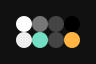 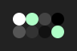 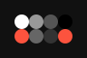 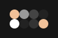

### Light

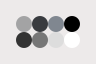 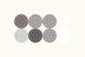 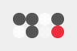  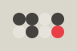

### Color

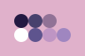 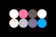 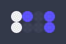 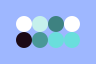 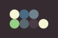

See the full collection [here](https://github.com/hundredrabbits/Themes/tree/master/themes).

### Generate themes with [pywal](https://github.com/dylanaraps/pywal)

Themes can be generated from your wallpaper’s colors with [pywal](https://github.com/dylanaraps/pywal).

Add [pywal.svg](themes/extras/pywal.svg) to `~/.config/wal/templates` and run `wal`. The generated theme will be located in `~/.cache/wal/`.

## Supported Applications

- [Dotgrid](https://github.com/hundredrabbits/Dotgrid), vector tool.
- [Ronin](https://github.com/hundredrabbits/Ronin), pixel tool.
- [Orca](https://github.com/hundredrabbits/Orca), programing language.
- [Left](https://github.com/hundredrabbits/Left), writing tool.
- [Nasu](https://github.com/hundredrabbits/Nasu), spritesheet editor.
- [Marabu](https://github.com/hundredrabbits/Marabu), music tool.
- [Donsol](https://github.com/hundredrabbits/Donsol), card game.
- [Paradise](https://github.com/hundredrabbits/Paradise), IF playground.
- [Pilot](https://github.com/hundredrabbits/Pilot), synthetiser.
- [Verreciel](https://github.com/hundredrabbits/Verreciel), space game.

This collection may also be used with:

- [Tape](https://aeriform.itch.io/tape) by Aeriform.
- [Memex](https://github.com/kormyen/memex) by Kormyen.
- [Autograph](https://github.com/jameschip/Autograph) by James Chip
- [Dot Matrix](https://github.com/lainsce/dot-matrix) by Lains

## Extras

You are welcome to submit your own themes to this collection.
