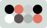
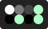
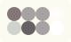

# Themes
This collection of themes are meant to be used with [Ronin](https://github.com/hundredrabbits/Marabu), [Left](https://github.com/hundredrabbits/Left), [Donsol](https://github.com/hundredrabbits/Donsol) and [Dotgrid](https://github.com/hundredrabbits/Dotgrid).
## Install
To install a theme, simply drag the `thm` file onto the application window.
You are welcome to submit your own themes to this collection!

## [apollo](themes/apollo.thm)

## [apollo11](themes/apollo11.thm)

## [berry](themes/berry.thm)

## [battlestation](themes/battlestation.thm)

## [blanc](themes/blanc.thm)

## [cina](themes/cina.thm)

## [commodore](themes/commodore.thm)

## [donsol](themes/donsol.thm)

## [gameboy](themes/gameboy.thm)

## [mahou](themes/mahou.thm)

## [marble](themes/marble.thm)

## [noir](themes/noir.thm)

## [pale](themes/pale.thm)

## [raspberry](themes/raspberry.thm)

## [seaweed](themes/seaweed.thm)

## [solitaire](themes/solitaire.thm)

## [soyuz](themes/soyuz.thm)

## [swiss](themes/swiss.thm)

